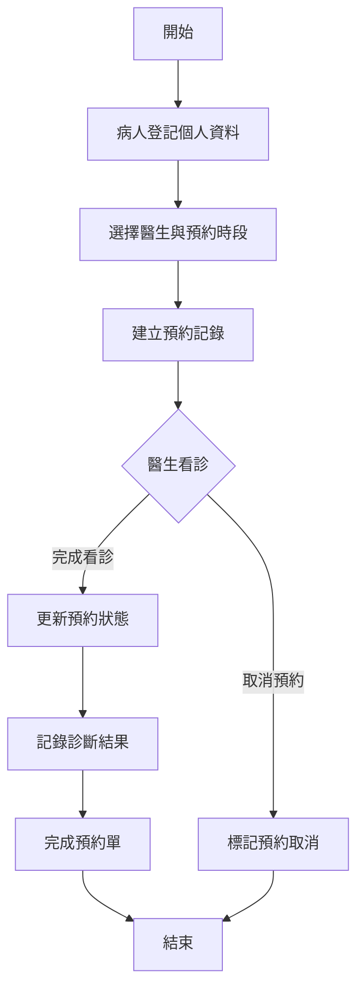

```mermaid
flowchart TD
    A["開始"] --> B["病人登記個人資料"]
    B --> C[選擇醫生與預約時段]
    C --> D[建立預約記錄]
    D --> E{醫生看診}
    E -->|完成看診| F[更新預約狀態]
    F --> G[記錄診斷結果]
    G --> H[完成預約單]
    H --> I[結束]
    
    E -->|取消預約| J[標記預約取消]
    J --> I
```